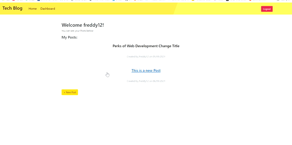

# Tech Blog
[](https://opensource.org/licenses/MIT)    


## General Information

* [GitHub repository of Tech Blog Full Stack Web Application](https://github.com/ZahraMertens/Tech-Blog.git)

* [Deployed Application in Heroku](https://serene-escarpment-55797.herokuapp.com/)


## Table of Contents
1. [General Information](#general-information)
2. [Task Description](#task-description)
3. [Installation Instructions](#installation-instructions)
5. [Technologies Used](#technologies-used)
6. [User Story](#user-story)
7. [Actual Behaviour](#actual-behaviour)
8. [Mock-Up](#mock-up)
9. [Credits](#credits)


## Task Description

The application "Tech Blog" is a full stack web application which displays users blog posts. In order to add, edit, delete or comment a post, the user must sign up or if the user already has an account must login to be able to use this functionality. The web application is build with node.js, myql, sequelize, express.js and handlebars to follow the MVC architecture.

## Installation Instructions

* 1️⃣ First the user must clone the [GitHub Repo](https://github.com/ZahraMertens/Tech-Blog.git) on its computer.

* 2️⃣ Open the repository on your device with VS Code (or any other program)

* 3️⃣ Open the command line at the folder location OR the integrated terminal 

* 4️⃣ First, you MUST install the npm packages by running "npm install" in the terminal

* 5️⃣ You also have to install MySql and create an account in order to be able to interact with the database

   * You then need to login to mysql on the command line by running the 'mqsql -u root -p' command and run SOURCE schema.sql and SOURCE seeds.sql to initialize the database

* 6️⃣ In order to be able to interact with the database out of mysql, the user must install the npm package "sequelize" to build a connection between the database and the server

* 7️⃣ To protect your personal data you need to create a ".env" file in the root of the repository, which includes your mysql password, the database name, and the user.

* 8️⃣ When the database is initialized then the user must run "node seeds/index" to seed the database with some given data

* 9️⃣The user must start the server in local host by runnding "npm start" and can then perform request in Insomnia

* 🔟 The user can then open the browser.

## Technologies Used

* JavaScript

* Node.JS

* Express.js

* MySQL

* Sequelize

* Handlebars

## User Story

```
AS A developer who writes about tech
I WANT a CMS-style blog site
SO THAT I can publish articles, blog posts, and my thoughts and opinions
```

## Actual Behaviour

* WHEN I visit the site for the first time
THEN I am presented with the homepage, which includes existing blog posts if any have been posted; navigation links for the homepage and the dashboard; and the option to log in

* WHEN I click on the homepage option
THEN I am taken to the homepage

* WHEN I click on any other links in the navigation
THEN I am prompted to either sign up or sign in

* WHEN I choose to sign up
THEN I am prompted to create a username and password

* WHEN I click on the sign-up button
THEN my user credentials are saved and I am logged into the site

* WHEN I revisit the site at a later time and choose to sign in
THEN I am prompted to enter my username and password

* WHEN I am signed in to the site
THEN I see navigation links for the homepage, the dashboard, and the option to log out

* WHEN I click on the homepage option in the navigation
THEN I am taken to the homepage and presented with existing blog posts that include the post title and the date created

* WHEN I click on an existing blog post
THEN I am presented with the post title, contents, post creator’s username, and date created for that post and have the option to leave a comment

* WHEN I enter a comment and click on the submit button while signed in
THEN the comment is saved and the post is updated to display the comment, the comment creator’s username, and the date created

* WHEN I click on the dashboard option in the navigation
THEN I am taken to the dashboard and presented with any blog posts I have already created and the option to add a new blog post

* WHEN I click on the button to add a new blog post
THEN I am prompted to enter both a title and contents for my blog post

* WHEN I click on the button to create a new blog post
THEN the title and contents of my post are saved and I am taken back to an updated dashboard with my new blog post -->

* WHEN I click on one of my existing posts in the dashboard
THEN I am able to delete or update my post and taken back to an updated dashboard

* WHEN I click on the logout option in the navigation
THEN I am signed out of the site

* WHEN I am idle on the site for more than a set time
THEN I am able to view comments but I am prompted to log in again before I can add, update, or delete comments


## Mock-Up

🎥 The GIF shows the Login and signup page of the web application:


🎥 The GIF shows comment a post functionality:


🎥 The GIF shows update a post functionality:


🎥 The GIF shows add a post functionality:


🎥 The GIF shows the delete a post functionality:




## Credits

* https://getbootstrap.com/

* https://handlebarsjs.com/

* https://expressjs.com/


© 2021 Zahra Mertens, Tech Blog